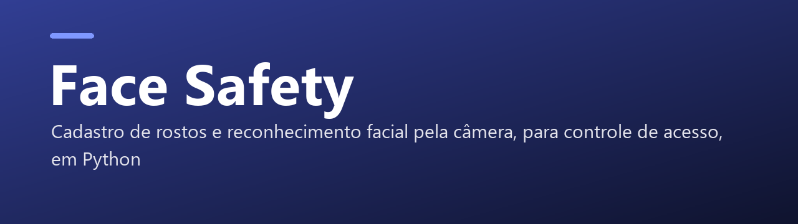
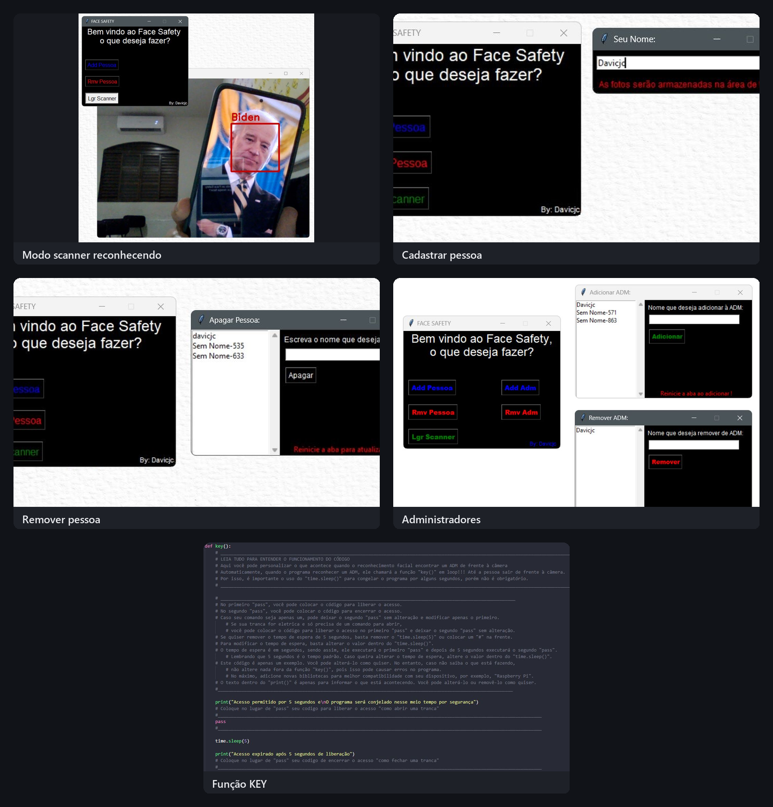

<p align="center">
  
</p>

<p align="center">
  
  
  
</p>

<p align="center">Face Safety: cadastro de rostos e reconhecimento facial pela câmera, para segurança ou controle de acesso, em Python (Windows e Linux).</p>

### 📸 Telas do sistema

<p align="center">
  
</p>

---

[[English version]](https://github.com/Davicjc/Face-Safety/blob/main/English%20version.md)

# 📷Face-Safety
### Windows & Linux 'beta': 
- Este é um programa em Python que utiliza a biblioteca de reconhecimento facial "face recognition". Ele permite adicionar fotos para que sejam detectadas pela câmera, excluir registros de pessoas e ativar o modo scanner, que apresenta o nome da pessoa ao entrar em frente à câmera. O programa pode ser utilizado para fins de segurança ou controle de acesso, caso seja adaptado corretamente.

# 🚀Atalhos:
- ["🪄 Executar 1 Clique"](https://github.com/Davicjc/Face-Safety#-executar-1-clique) (Essa versão não precisa de nenhum passo para executar, é só baixar e abrir!)
- ["📷Face-Safety"](https://github.com/Davicjc/Face-Safety#face-safety) (Sobre o programa/app)
- ["⬇️Como Baixar"](https://github.com/Davicjc/Face-Safety#%EF%B8%8Fcomo-baixar) (Para esse código, você precisa baixar algumas coisas obrigatórias que as bibliotecas pedem)
- ["🔬Como usar"](https://github.com/Davicjc/Face-Safety#como-usar) (Aprenda a usar o programa com todos os detalhes)
- ["🗝️Função KEY"](https://github.com/Davicjc/Face-Safety#%EF%B8%8Ffun%C3%A7%C3%A3o-key) (Essa parte permite gerenciar sistemas como portas eletrônicas e sistemas de monitoramento, podendo ser utilizado em um Raspberry Pi ou qualquer outro lugar onde o código seja compatível. Você pode adicionar administradores e executar ações personalizadas quando um administrador é reconhecido pela câmera)

### Contato:
 - E-mail: [davicjc@gmail.com]() "Mais utilizado"
 - Telegram: [@Davicjc](https://t.me/Davicjc)

# 🪄 Executar 1 Clique:

- 📢 "Apenas para Windows por ser um '.exe'"
- Clique aqui: ["BAIXAR"](https://1drv.ms/u/s!AnmOlIL4SXyggoBBImepRALWGBEUfA?e=P84JPt)
- Essa versão não precisa de nenhum passo para executar, é só baixar e abrir!
- "Lembrando que essa versão não é possível usar a função "KEY" editável, pois não é possível editar o código, porém tudo funciona.
- Caso aconteça algum erro, o que é bem raro, execute esse codigo no cmd: ```pip install dlib && pip install face_recognition && pip install numpy && pip install opencv-python``` e tente novamente!
- "Obrigatório câmera! Lembrando que, dependendo do PC, ao abrir, pode demorar um pouco para ser executado 100%".

# ⬇️Como Baixar:

### Para esse código, você precisa baixar algumas coisas obrigatórias que as bibliotecas pedem:

- 📢 "Para o Linux, você deve baixar todas as dependências que serão mostradas abaixo, exceto a instrução do "Visual Studio". E lembre-se de que o método de instalação no Linux de cada etapa pode ser diferente da maneira feita no Windows. Qualquer dúvida, consulte o ChatGPT, e se não conseguir, entre em contato."

- Vá à loja da Microsoft e baixe a versão mais recente do Python disponível. Caso queira usar a mesma versão utilizada neste código, basta acessar este link: ["Py-3.11"](https://apps.microsoft.com/store/detail/python-311/9NRWMJP3717K).

- Segundo passo, baixe esse programa: ["Visual Studio"](https://visualstudio.microsoft.com/pt-br/visual-cpp-build-tools/). Ao executá-lo, ele abrirá uma página de download. Nessa página, selecione a opção "Desenvolvimento para desktop com C++", que geralmente é a primeira opção, e clique em instalar.

- Terceiro passo, você precisa baixar este programa: ["CMake"](https://cmake.org/download/). Durante a instalação, é importante marcar a opção "Add CMake to the system PATH for all users" para evitar problemas. Após isso, você pode continuar o download do programa. Aviso: assim que o programa for baixado, é importante abri-lo pelo menos uma vez e, em seguida, você pode fechá-lo. Baixe o arquivo correspondente ao seu sistema operacional e certifique-se de instalar a versão do programa "Installer". Por exemplo, se você estiver usando o Windows, baixe o instalador para Windows x64.

- Após fazer os últimos passos, recomendo reiniciar o PC. Para fazer essa etapa, abra seu CMD e execute o seguinte comando: ```pip install dlib && pip install face_recognition && pip install numpy && pip install opencv-python```

- Após seguir todas essas etapas, você pode abrir o arquivo do programa ["Face Safety.py"](https://github.com/Davicjc/Face-Safety/releases).

- "Caso ocorra algum erro, pode ser um problema isolado relacionado ao seu sistema atual. Em caso de dúvidas, entre em contato pelo 'ctt no perfil'."

# 🔬Como usar:

### Não esqueça de seguir as instruções da seção "[Como Baixar](https://github.com/Davicjc/Face-Safety/blob/main/README.md#como-baixar)".

- Esta parte é a página inicial, onde você pode acessar as opções do programa.


- Esta é a tela que aparece ao clicar no botão 'Adicionar Pessoa'. Nesse campo em branco, você irá colocar o nome da pessoa que deseja cadastrar. Após isso, a câmera será aberta e irá aguardar que você aperte qualquer tecla para tirar a foto. Caso o rosto não seja encontrado na imagem, o scanner não funcionará e você deverá apagar o cadastro na opção 'Remover Pessoa'. Depois, você pode refazer o cadastro da pessoa novamente em 'Adicionar Pessoa'. Lembrete: é importante não colocar nomes repetidos.


- Nessa parte, você pode escolher quem você irá remover, que são as "fotos" que ficam salvas em sua área de trabalho. Para apagar uma pessoa pelo programa, ele apresentará uma lista de cadastros. Ao encontrar a pessoa que deseja apagar, basta escrever o nome exatamente como foi cadastrado e depois apertar o botão "apagar". O nome da pessoa será excluído nesse ponto do processo. Ao sair da aba "Remover Pessoa" e entrar novamente, a pessoa não constará mais na lista, caso tenha realizado essa etapa corretamente.


- Por fim, este é o scanner. Ao apertá-lo, automaticamente carregará as pessoas cadastradas e começará a verificar os rostos com seus respectivos nomes. Se houver algum erro, pode ser devido a um cadastro em que a face da pessoa está com difícil acesso, como o uso de bonés ou falta de iluminação, por exemplo.
 

# 🗝️Função KEY:
### Pode ser personalizado...

- Essa parte é apenas para aqueles que irão usar o código para gerenciar algo, como portas eletrônicas, sistemas de monitoramento, entre outros. Também haverá suporte para o [Raspberry Pi](https://www.raspberrypi.org/). Nestas duas abas, você pode adicionar uma pessoa como administradora. Sendo assim, no final do código haverá um "Def Key". Quando uma pessoa entrar na frente da câmera e o nome dela estiver na lista de administradores, ela irá chamar essa função e executará o que estiver dentro dela "em loop". Caso contrário, se uma pessoa sem poderes administrativos ou alguém que não esteja cadastrado ficar na frente da câmera, ela não será chamada. Dessa forma, quem for utilizar este código pode realizar uma ação, como destrancar ou trancar uma porta, por exemplo, por meio desta variável. Lembrando que dentro dessa função ela pode ser totalmente personalizada caso você tenha conhecimento do que esteja fazendo.


- [Imagem da parte referente do código que pode ser modificada](https://github.com/Davicjc/Face-Safety/blob/main/Fotos/Key%20Img.jpg?raw=true)

---

<p align="center">Feito por <a href="https://github.com/Davicjc">Davi Castro</a> · <a href="https://davicjc.com">davicjc.com</a></p>
